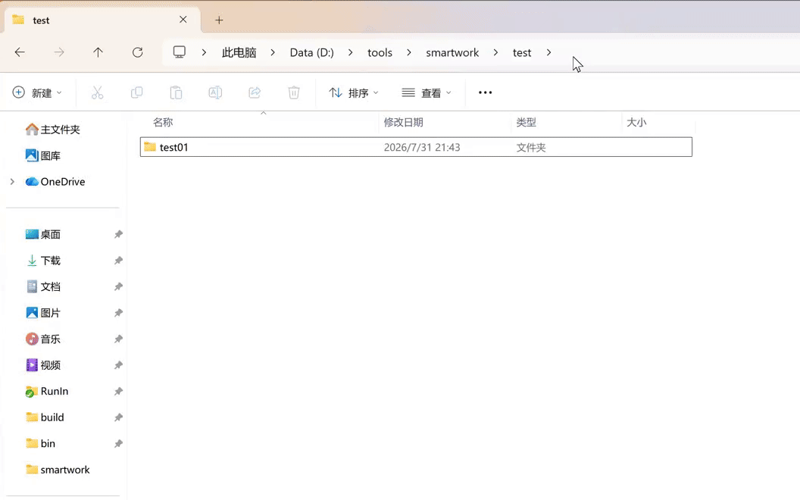

# 🚀 RunIn - The Ultimate Cross-Platform Terminal Launcher

RunIn is a lightweight, portable, and highly configurable cross-platform terminal launcher. It allows you to instantly launch your favorite terminals, shells, or command-line tools directly into the directory you are currently working in, with zero configuration required.

Whether you are using PowerShell, Git Bash, MSYS2, Cmder on Windows, or native Bash, Zsh, Fish, Tmux, or Zellij on Linux/macOS, RunIn brings them all together into a single, accessible context menu.

**Common Scenarios:**
- **Windows**: You opened a directory in Git Bash and pulled the latest code from GitHub. Then, you opened the same directory using x64 Native Tools Command Prompt to compile the project. Afterward, you opened the directory in VS Code to review the code.
- **Linux/Mac**: You SSH into an Ubuntu server, type `ri` in your default Bash, and select Zsh to open a clean new shell for testing. After typing `exit`, the screen seamlessly restores to your original Bash session's exact state before you typed `ri`, preserving all scrollback history as if nothing happened.


---

## 🎬 Demo

The following GIF demonstrates the typical usage of RunIn on Windows (type `ri` in the File Explorer address bar, select Git Bash from the popup menu; and type `ri 1` to directly launch Git Bash):



> If the animation does not display, ensure `assets/introduce.gif` is placed in the `assets` folder under the project root, or simply try the program yourself.

---

## ✨ Key Features

### General Features
- **Popup Menu at Cursor / In-Terminal**: Enter `ri` in the Windows File Explorer address bar, or double-click `ri.exe` to pop up the menu. On Linux/macOS, simply type `ri` in any terminal to bring up the TUI menu. Selecting any terminal automatically switches to the current directory.
- **One-Click Auto Search**: Built-in auto-discovery for 20+ popular terminals and dev tools (Windows). Linux/macOS automatically detects installed Shells and multiplexers.
- **Pending Templates**: If a selected terminal isn't installed, RunIn creates a "Pending" template in your config, allowing you to manually fill in the path later without breaking your list.
- **Auto Working Directory Mapping**: Automatically maps your current File Explorer or terminal directory to the launched terminal using the `{current_dir}` dynamic variable. No more `cd` typing!
- **100% Portable**: No installation required. All configurations are saved in a single `config.ini` file alongside the executable.
- **Blazing Fast & Lightweight**: Pure C++, no background processes. Just a tiny executable.
- **Direct Command Line Launch**: Bypass the menu by passing the index number as an argument (e.g., `ri 3`). Perfect for integration with other tools or scripts.

### Linux/macOS Exclusive Features
- **Alternate Screen Buffer Restoration**: Utilizes VT100 commands (`\033[?1049h/l`) to activate an independent screen buffer when launching a new shell. Upon exit, the original shell's historical output is seamlessly restored, exactly like exiting `vim`, without polluting the terminal scrollback.
- **Industrial-Grade Signal Isolation (Ctrl+C Immunity)**: Uses a `fork & wait` process model with signal handling. Spamming `Ctrl+C` in the new shell to terminate tasks won't crash the parent `ri` process or trap you in a blank alternate screen.
- **Scrollback-Preserving TUI Menu**: Abandons destructive full-screen clear commands. The `ri` menu uses in-place redrawing (ANSI cursor control), allowing users to scroll up at any time to view previous output records.
- **Smart SSH Environment Awareness**: Automatically hides all GUI terminal tools during SSH sessions, showing only TUI tools available in the command-line environment, preventing accidental GUI launches on headless servers.
- **Dynamic Welcome Prompt**: After launching a new environment, displays a colored dynamic welcome message at the top of the screen (including tool name, current working directory, and time), prompting the user to type `exit` to return.

---

## 🛠️ Supported Auto-Search Terminals

RunIn can automatically detect and configure the following tools:

| Platform | Category | Terminals / Tools |
| :--- | :--- | :--- |
| **Windows** | **Shells & Basics** | CMD, PowerShell, PowerShell 7, Windows Terminal |
| | **Git** | Git Bash, Git CMD |
| | **MSYS2** | MinGW x64/x86, MSYS, Clang x64, UCRT x64 |
| | **Conda** | Anaconda PowerShell Prompt, Anaconda Prompt |
| | **Visual Studio** | x64 Native Tools Cmd, x64_x86 Cross Tools Cmd |
| | **Emulators** | Cmder, ConEmu, Warp |
| | **WSL & Multiplexers**| WSL (PS7), WSL (CMD), Zellij (WSL), Tmux (WSL) |
| | **Modern CLI / AI** | Zellij (Native), Codex, Claude Code |
| | **Other GUI tools** | VS Code, Virtual Studio, File Explorer |
| **Linux/macOS** | **Terminal Emulators (GUI)**| GNOME Terminal, Konsole, Mac Terminal, iTerm2 |
| | **Base Shells** | Bash, Zsh, Fish |
| | **Multiplexers (TUI)** | Tmux, Zellij |

---

## 📖 Usage Guide

### 1. First-time Setup

- **Windows**: Double-click `ri.exe` to pop up the menu, select the `Setting` item to enter the configuration interface. Click the `Add to System PATH` button to add `ri.exe`'s directory to the system PATH. Use the `Auto Search Terminals` button to automatically detect installed terminals. Finally, click `Save Config` to exit.
- **Linux/macOS**: Place the `ri` executable in your system's PATH (e.g., `/usr/local/bin` or `~/.local/bin`). Type `ri` in any terminal, select `Setting` to enter the TUI configuration interface, choose `Add Tool`, and use the built-in templates to add your desired Shells or terminals.

### 2. Address Bar Mode (Windows)

Enter `ri` in the File Explorer address bar, or double-click `ri.exe` (or bind it to your mouse side button) to pop up the menu. Select any terminal to launch it in the current directory.

### 3. In-Terminal Mode (Cross-Platform)

Simply enter `ri` in various terminal applications to bring up a menu and select the desired terminal. Selecting any menu item will launch that terminal tool in the current directory.

**Linux/macOS Typical Scenario**: While connected to an Ubuntu server via SSH, you finish compiling code in your default Bash and want a clean environment to test it. Type `ri`, select Bash. The screen flashes and displays `RunIt: Bash started at /home/user/project on 2024-05-24 15:30:45...`. After running your tests, type `exit`, and the screen instantly restores the previous compilation output state.

### 4. Direct Command Line Launch (Cross-Platform)

You can bypass the menu by passing the index number as an argument. For example, if you remember that PowerShell / Zsh is item #2 in the menu, you can type `ri 2` to directly launch it and switch to the current directory.

---

## 🔧 Building from Source

If you prefer to compile RunIn yourself, follow these steps:

### Windows
1. Create a `build` folder in the project root.
2. Open the **“x64 Native Tools Command Prompt for VS”** (Visual Studio developer command prompt) and change to the `build` directory.
3. Run the following CMake commands to generate NMake build files and compile:
```bash
   cmake -G "NMake Makefiles" -DCMAKE_BUILD_TYPE=Release ..
   cmake --build .
   ```

### Linux / macOS
1. Make sure that you have installed `g++` or `clang++` and `make` and `cmake`.
2. Create `build` and switch.
3. Build use cmake and make.

   #### Ubuntu/Debian
   ```bash
   sudo apt update && sudo apt install build-essential cmake
   mkdir build && cd build
   cmake ..
   make
   sudo cp RunIn /usr/local/bin/
   ```

   #### RHEL/CentOS/Fedora
   ```bash
   sudo dnf install gcc gcc-c++ cmake
   mkdir build && cd build
   cmake ..
   make
   sudo cp RunIn /usr/local/bin/
   ```

   #### macOS (Intel & Apple Silicon) 
   ```bash
   xcode-select --install
   brew install cmake
   mkdir build && cd build
   cmake ..
   make
   sudo cp RunIn /usr/local/bin/ 
   # For Apple Silicon (M1/M2),/opt/homebrew/bin or /usr/local/bin is OK
   ```

